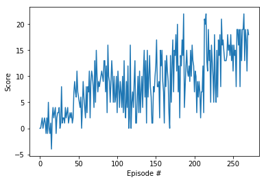

# Learning Algorithm

### **Introduction**

A Deep Q-Network (DQN) was used for this project that was adapted from a previous lesson. Minor modifications had to be made from the previous lesson implementation to work with a Unity environment. In addition, hyperparameters and the average of rewards needed was modified to meet the project rubric requirements.

### **Algorithm**

Traditional reinforcement learning algorithms typically utilize a Q-table that maps discrete states and actions together. The Q-table values along with a form of temporal difference learning like SARSA or Sarasamax are used to alter those values to allow a policy to choose the best possible action for a given state that maximizes future reward.

Where a DQN differs is that instead of a Q-table being formed to map discrete states to actions, a deep neural network is used in place of the Q-table. This is where Deep reinforcement learning gets its name, it is a mix of traditional reinforcement learning techniques along with deep neural networks. To clarify further, instead of forming a Q-table, a deep neural network is used to predict Q-table values for a given state.

Using a deep neural network in place of a Q-table has a few distinct advantages. Most notably, Q-tables can become excessively large in continuous state spaces. To use traditional reinforcement learning techniques in a continuous space requires some kind of discretization of the environment that an agent will be working in, this is sometimes just not possible. In addition, neural networks are highly non linear by nature and often offer superior performance at given tasks when trained properly.

What are the disadvantages? Reinforcement learning is notoriously unstable while using a neural network to represent actions values for a Q-table.

To make DQN work, there are two key techniques that need to be implemented to stabilize the learning process effectively. These two techniques are **Experience Replay** and **Fixed Q-Targets**.

Experience Replay was used to add some randomness to the training process and reduce correlation between environment samples. A memory bank of experiences was created that saved experiences from the environment while taking random actions. After the memory bank was full of experiences, samples were randomly chosen and used for training in the backpropagation process of the network. Choosing samples randomly and training on them ensures that the network does not form a bias as a result of successive state sequences being trained on. A network bias could cause one sided predictions to develope for any number of states. This would result in network weights not converging on the most optimal answer or generalization of the task at hand.

Fixed Q-targets combats a different type of correlation. In a normal supervised deep neural network learning task we have a target value to train against, a *truth* known to us that we would like a network to converge to.

In a reinforcement learning setting the optimal state value function Q(\pi)* target is not known, so an estimation needs to be made in regard to the true state value function target. The target used typically is `max(state', A)` (state' -> state prime, A -> state primes action values).

If an estimation is obtained by making a prediction using the network we are training on, the significance of that is the target we are adjusting to is affected by the weights we are adjusting. The correlation between targets and predictions are the weights of the network. By using the network we are training on to get `y^` (prediction) and using the *same* network to generate a target value get to, a game of cat and mouse has been created.

By sharing weights between targets and predictions an optimal policy may never be found because the target is changing between training batches. The math can spiral out of control or oscillate wildly causing learning to stall or just not work at all.

The solution presented by Fixed Q-Targets is to use two networks that separate target weights and prediction weights. Target weights are copied from the prediction network initially, the target network weights stay frozen for a given number of episodes while training, this freezes the values we are adjusting to for the prediction network (sometimes called local network). This gives the network a chance to minimize its loss, I tend to think of it as a form of stochastic error minimization because this is obviously an extremely rough estimate of the optimal target value. However, when coupled with an epsilon greedy policy action selection, the environment is explored and exploited enough to learn the best action for a given state given enough time steps/episodes.

After a given number of episodes prediction network weights are copied over to the target network and training continues with the new target weights frozen while the prediction networks weights are adjusted further. The technique helps stabilizes learning and allows the agent to learn the optimal policy for an environment. When and how network weights are copied from prediction -> target also utilizes hyperparameters/techniques for convergence of the algorithm and are a whole other topic in itself.

### **Deep Neural Network Architecture**

The deep neural network architecture used was as follows:

|Layer | Value |
|:-----:|:---:|
|Input|environment state (vector length 37)|
|Linear Layer|37x64|
|Relu|Activation|
|Linear|64x64|
|Relu|Activation|
|Linear|64x4|
|Output|action space (vector length 4)|

Index of output corresponds to an action as follows:

- **`0`** - move forward.
- **`1`** - move backward.
- **`2`** - turn left.
- **`3`** - turn right.

### **Hyperparameters**

 The follow hyperparameters were used during training:

        BUFFER_SIZE = int(1e5)  # replay buffer size
        BATCH_SIZE = 256        # minibatch size
        GAMMA = 0.99            # discount factor
        TAU = 1e-3              # for soft update of target parameters (blends networks slowly)
        LR = 1e-4               # learning rate (aka alpha)
        UPDATE_EVERY = 3        # how often to update the network
        n_episodes=1500         # total number of episodes to train for
        max_t=2000              # max number of time steps per episode
        eps_start=1.0           # epsilon starting value
        eps_end=0.01            # epsilon decay minimum value
        eps_decay=0.75          # epsilon decay rate

These parameters were adjusted individually between training runs to learn how they affected the agents ability to learn. Ultimately the values used above were chosen via trial an error based on the agents ability to learn the task well enough to meet the rubric spec, an average reward of 13.0 over 100 episodes. I also made an effort to adjust these parameters to get to the spec in the lowest number of episodes.

## Plot of Rewards

A plot of rewards obtained per episode during training:

Using the given hyperparameters above the plot demonstrates that the environment was solved per spec in 271 episodes with a average reward of 13.12 (See last code cell of jupyter notebook for training code).

---

## Future Improvements

To improve this algorithm further there are numerous changes that could be made.

For example, all hyperparameters could be kept the same while different deep neural network architectures utilized. Also, leaving the network the same and implementing DQN improvements like *Prioritized Experience Replay* and *Dueling DQN* could further improve the algorithms performance in fewer episodes. Lastly, hyperparameters could be further tuned to fined better combinations without touching the underlying example.
